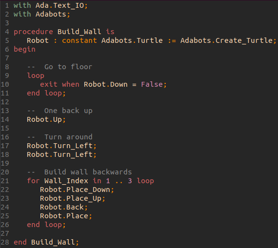
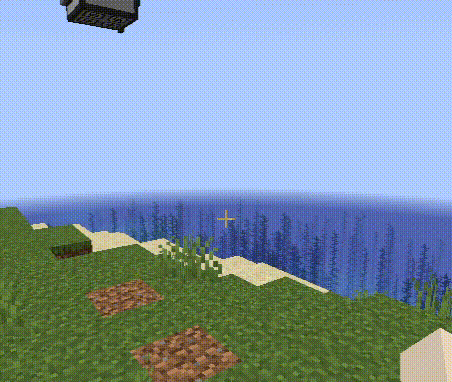

# Learn Ada with programmable bots!

Program Text               |  Demo
:-------------------------:|:-------------------------:
  |  

The computercraft mod for Minecraft adds programmable robots called turtles,
which can move around, dig tunnels, build walls and interact with anything in-game.

AdaBots helps to teach children and adults alike the Ada programming language.
If your child cannot read yet, I recommend you start him / her on
[DoBots](http://github.com/TamaMcGlinn/DoBots) first.

It is possible to use the small terminal window in-game and the built-in scripting
language Lua to write programs, but I wanted to make this easier. This is a standalone
program you can run on your computer locally, outside of minecraft, which issues commands
to the in-game turtles. This means you can use a real programming environment, with
code-completion, a debugger, static-analysis and even mathematical proofs of program
correctness using SPARK.

## Why Ada?

Ada is a very safe, easy to learn language. It was designed from the ground up to be easy
to understand and difficult to make mistakes in. It is case-insensitive, disallows assignment
inside conditional statements, has explicit `end if;`, `end loop;` etc. instead of the popular
but confusing `}` in most programming languages, disallows all implicit type conversions
(which also makes it possible to overload on return type), and even makes multithreading easy with
its simple tasking and rendez-vous idiom. Since you can create tasks and multiple turtles in a single
program, you could explain these concepts intuitively using AdaBots.

In addition, the Ada compiler is an unusually helpful one, saying things like:

```
lovelace.adb:10:04: warning: variable "Blocks" is never read and never assigned

lovelace.adb:20:30: error: "Dat" is undefined
lovelace.adb:20:30: error: possible misspelling of "Data"
```

# Getting started

You will need:

- A minecraft or minetest installation
- An Ada development environment

## Minecraft / Minetest install instructions

You can use either Minecraft or Minetest to run a commandlistener for AdaBots programs.

I recommend using Minecraft for this; either connect to a server with ComputerCraft already installed,
or [install Adabots in single-player](docs/minecraft_installation.md).
Currently, the minetest implementation is early Work-In-Progress; movement, digging and block placement works, but expect bugs.
[Minetest installation instructions here](docs/minetest_installation.md).

## Ada environment

For Ada programming, you will need to install:

- An Ada compiler ([run the installer for your platform here](https://www.adacore.com/download))
- An IDE ([details here](docs/ide.md))
- [Alire (alr)](https://alire.ada.dev/)

Clone the [AdaBots_examples repo](https://github.com/TamaMcGlinn/adabots_examples) to have a project up and running quickly.
Just open adabots_examples.gpr and src/build_wall.adb in your IDE.

### Compile & Run

Open a terminal and issue `make`. It should be around ten minutes the first time, but should only take seconds afterwards.

To start the program, run `./bin/[program_name]` in a terminal.

Assuming listen is already running on a minecraft turtle, or `turtle:listen()` on a minetest turtle, it should start moving.

## What to do?

Now that everything is working, you need something to do. If you are on your own, set yourself some goals:

- build a staircase down (3 blocks tall, so you can follow!), and then
- a cavern of 10 x 10, 3 blocks tall

Or, on the surface, build yourself a house, a tower, or a castle. The sky and bedrock are the limits!

### Ada basics

To teach (children) using AdaBots, you need at least a basic understanding of programming (not necessarily with Ada).
I recommend the AdaCore [Introduction to Ada](https://learn.adacore.com/courses/intro-to-ada/) (html / pdf)
as a course syllabus. Next, you need to stay one lesson ahead of your pupils by experimenting yourself first.

### Read the example programs

There is a collection of example programs [here](https://github.com/TamaMcGlinn/AdaBots_examples).
I recommend you use them as a starting point for using AdaBots.
