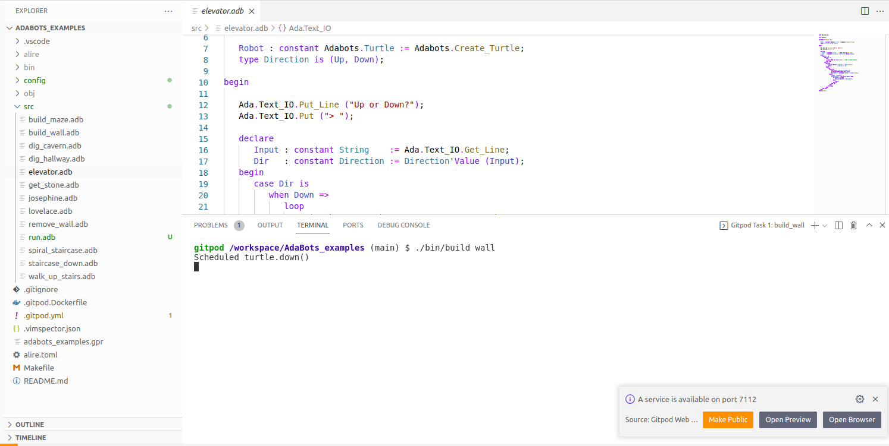
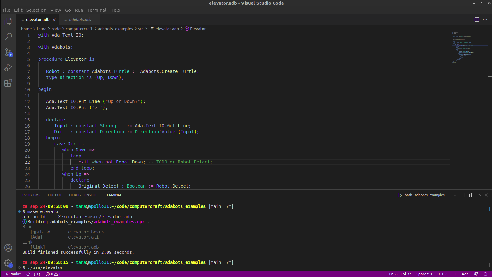
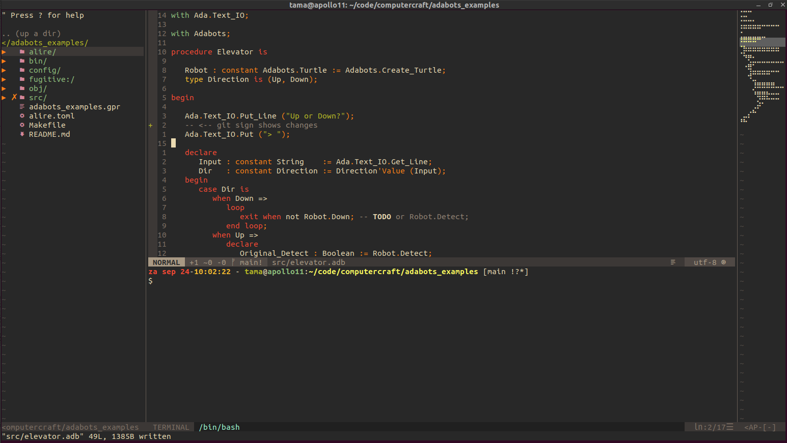
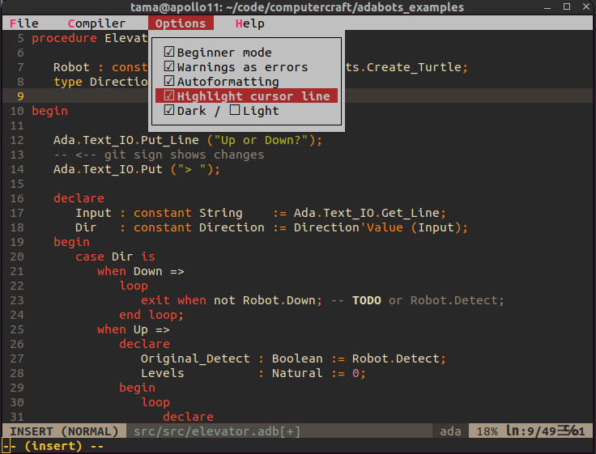

# Choosing the IDE for you

There are several options that work well with Ada, you should choose the one that fits you best.

- Gitpod.io
- VSCode
- GPS
- NeoVim
- ABE

## [Gitpod.io](https://gitpod.io/)

Gitpod.io is the only option which works from your browser, requiring no installation at all.
Fork the [adabots_examples](https://github.com/TamaMcGlinn/adabots_examples) git repo and open it
in gitpod.io. Cntrl-Click to jump to references. Code-completion should also work.

A major difference is that your program will not be running locally on your computer, but on the gitpod
server. This might be the only solution if you are behind a firewall. The downside is that the turtle
needs to listen to e.g. https://7112-tamamcglinn-adabotsexam-x2l6wkftupp.ws-eu67.gitpod.io/ on port 443,
instead of a nice simple local LAN ip and port of choice. When running a program, you can click 'Ports'
to copy the url into the turtle program.

## [VSCode](https://code.visualstudio.com/)

VSCode is a standalone general code editor supporting all programming languages, with many additional
features, such as supporting version control using git. After opening it, click 'Extensions' and install the Ada plugin.

## [GPS](https://www.adacore.com/gnatpro/toolsuite/gnatstudio)

GNAT Programming Studio is a standalone Ada code editor. It comes with Ada support built-in, but comes with less features than VSCode, 
and is less widely used, as it primarily supports Ada.

## [NeoVim](https://neovim.io/)

Similar to VSCode, this is a general code editor supporting all programming languages. The main difference are modal editing
and that it works via terminal. Configuration of Vim / NeoVim is via a full-fledged programming language, and it has been available
since 1991, so it has a lot of plugins and configuration options, but unfortunately also a steeper learning curve.

Since NeoVim (and ABE below) work in the terminal, you can use [Wemux](https://github.com/zolrath/wemux) to share a keyboard between teacher and student.

## [ABE](https://github.com/TamaMcGlinn/adabots_editor)

AdaBotsEditor is a custom NeoVim configuration designed to ease installation and bridge the learning curve. It is hosted in a docker image,
and comes with adabots_examples already built inside.

