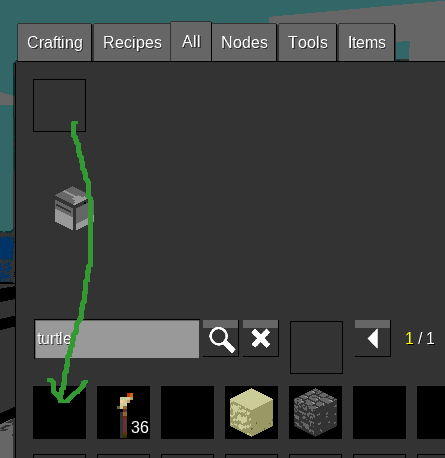

# Minetest install instructions

## 1) Install minetest

For Ubuntu, open a terminal and put in:

```
sudo apt install minetest
```

## 2) Install [minetest-adabots](https://github.com/TamaMcGlinn/minetest-adabots)

- Go to [https://github.com/TamaMcGlinn/minetest-adabots](https://github.com/TamaMcGlinn/minetest-adabots)
- Click the green "Code" button on the top-right
- Click download zip.
- Unzip minetest-adabots-master.zip into the minetest mod dir (~/.minetest/mods/ on linux, minetest-install-directory/mods/ on windows)
- rename the minetest-adabots-master directory to adabots

## 3) Configure minetest

- Open minetest
- Go to Settings > All Settings
- Search for "secure"
- Set httpmods to include `computertest`

## 4) Get listen program onto the turtle

Give yourself a turtle:

- Press I for inventory
- Select the 'All' tab
- Enter 'turtle' in the search bar
- Click the turtle
- Click a slot in the top row of your inventory



Place the turtle in the world, and start the listen program:

- Right click the turtle
- Click 'open terminal'
- Enter `turtle:listen()`

turtle:listen takes three optional parameters:
- ip address (defaults to "localhost")
- port (defaults to "7112")
- tickrate in seconds (defaults to 0.3)

Another example call to put in the turtle's command window would be `turtle:listen("192.168.0.22", "7112", 0.1)`
to get a faster turtle listening to a different computer on your LAN.
